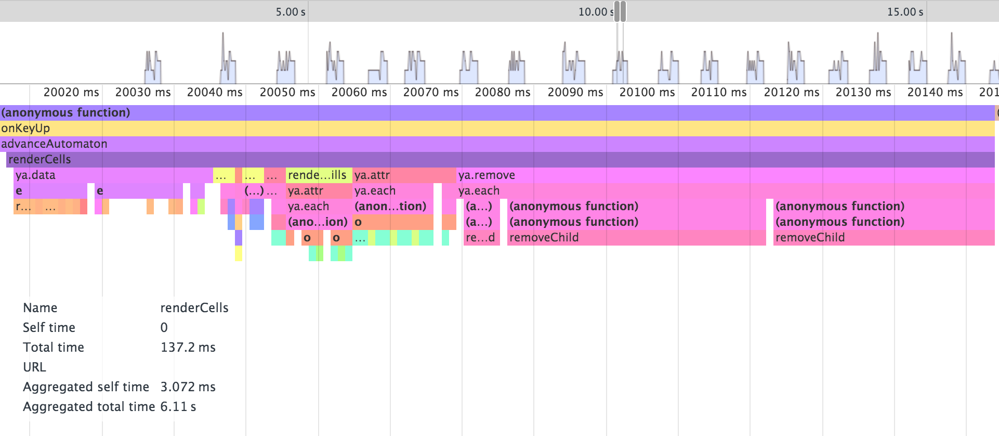
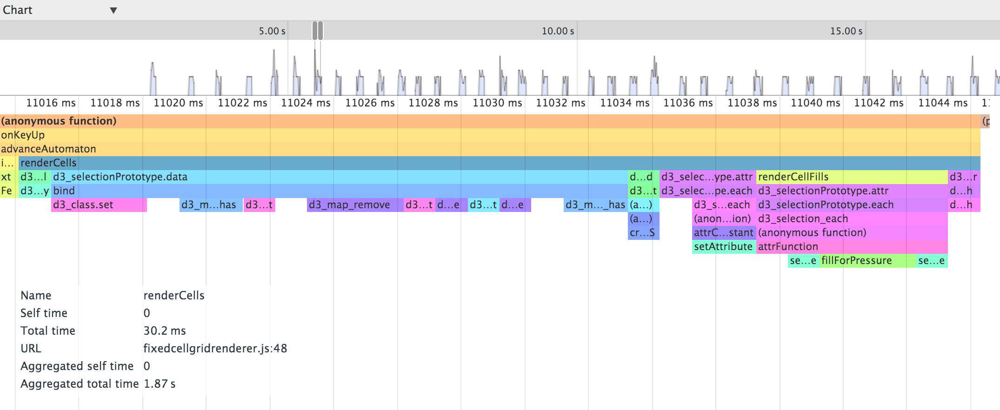

I have been working on a [cellular automaton](https://github.com/jimkang/reactivecell). The latest thing I did with it was to make it run in the browser. (Before I was running it with Node.) That part was smooth, but when I hooked it up to some [straightforward D3 rendering code](https://github.com/jimkang/cellgridrenderer) to render each cell at each iteration, I ran into some trouble. It was sluggish once there were about 6000 cells out.

D3 apps usually work around an [enter/update/exit](http://bost.ocks.org/mike/join/) loop. Each iteration, you tell D3 to "join" the data (an array of some sort) with the DOM (usually SVG) elements that represent them. D3 figures out:
- Which data elements are not currently represented in the DOM
- Which data elements are represented (but may need updating)
- Which DOM elements represent data elements that no longer exist

It gives you the first and the last set as via `enter()` and `exit()`. Usually, you use the selection returned by `enter()` to create new DOM elements to represent the new data, and you use `exit()`'s selection to remove DOM elements. That's what I was doing.

     function renderCells(cells) {
        var cellRenditions = tileRoot.selectAll('.' + opts.cellClass)
          .data(cells, a.id);

        var newCellRenditions = cellRenditions.enter()
          .append('g').classed(opts.cellClass, true);

        newCellRenditions.append('rect').attr({
          x: 0,
          y: 0,
          width: 1,
          height: 1
        });

        if (opts.customizeCellRendition) {
          cellRenditions.each(opts.customizeCellRendition);
        }

        cellRenditions.attr('transform', a.transform);

        cellRenditions.exit().remove();
      }

I profiled some late iterations in Chrome DevTools to check out see where time was being spent in the code. Here's what the flame graph for a single iteration's rendering looked like:

Rougly 80 ms was spent in `removeChild`. The entire `renderCells` call took 137 ms. So I thought, are `removeChild` calls something I eliminate?

Removing DOM elements makes sense for a lot of visualizations. A datum could disappear after an interation and never appear again.

In a cellular automaton, all of the cells are in fixed positions. In my cellular automaton, only cells that do not match the profile of a "default cell" are tracked and rendered. Thus, a cell can "disappear" (become a default cell) in one iteration, and then "reappear" (become a cell that deviates from the default). So, I tried out [hiding exiting cells instead of removing them](https://github.com/jimkang/cellgridrenderer/blob/master/fixedcellgridrenderer.js):

    function renderCells(cells) {
      var cellRenditions = tileRoot.selectAll('.' + opts.cellClass)
        .data(cells, opts.idFunction);

      var newCellRenditions = cellRenditions.enter()
        .append('g').classed(opts.cellClass, true);

      newCellRenditions
        .append('rect').attr({
          x: 0,
          y: 0,
          width: 1,
          height: 1
        })
        .attr('transform', a.transform);

      cellRenditions.attr('opacity', 1.0);

      if (opts.customUpdate) {
        opts.customUpdate(cellRenditions);
      }

      // Hide exited cells instead of removing.
      cellRenditions.exit()
        .attr('opacity', 0);
    }

Here is the flame graph looked like after that change:

Now `renderCells` takes about 30 ms. Most of that time is now spent in the data join.

Ask your doctor if hiding instead of removing DOM elements in your app is right for you.
