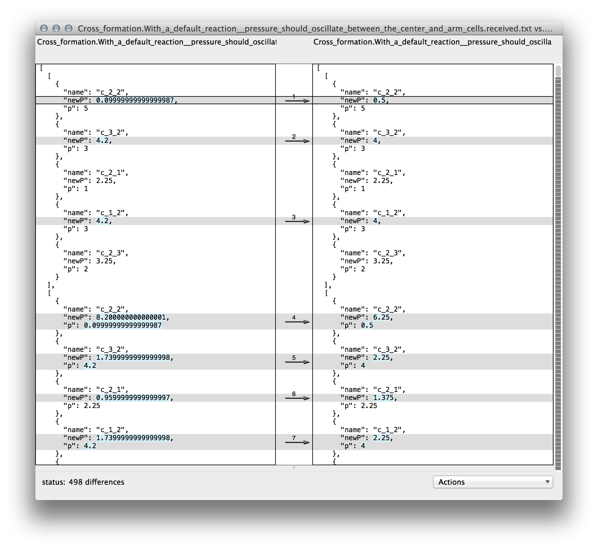

Here's an ugly thing I think you inevitably run into when writing tests: Having to specify tons and tons of reference values to which to compare test results. Then, wanting to kill yourself.

We use computers in part because they're good at doing the same thing over and over again. Any person can multiply 9 x 9. (It's 81.) [A computer can multiply huge numbers.](https://www.youtube.com/watch?v=tUY1k7B7hgM#t=00m50s) In fact, they can do this *many* times per second.

Amazing, but what is the by-product of all of this multiplication? Lots and lots of <a href="http://en.wikipedia.org/wiki/Product_(Mathematics)">products</a>, which, __you__, the programmer, must check for correctness.

Although it's likely that you are a multiplication developer doing big things in the multiplication space, for the sake of this post, let's generalize this to non-multiplication programming. The program's output need not be multiplication products; it could be, say, strings or objects.

    var enormousArray = getBigData(ids);

There's a few ways of testing this:

1. You could sample this array.

        var firstBigDatum = {
          id: 'kjasdflkadsjf',
          age: 24,
          SSN: '098-876-5432',
          weaknesses: [
            'bad left knee',
            'fear of crickets',
            'corgis',
            'not the greatest self-esteem',
          ]
        };

        var lastBigDatum = {
          id: 'iwermskldf',
          age: 38,
          SSN: '876-54-321',
          weaknesses: [
            'peanut allergy',
            'double-jointed in elbow (warning: also a strength)',
            'slow reader'
          ]
        };

        assert.deepEqual(firstBigDatum, enormousArray[0]);
        assert.deepEqual(lastBigDatum, enormousArray[enormousArray.length - 1]);
The problem with this is is that you have skipped testing elements `1` through `enormousArray.length - 2` of that array. That could be a lot of elements. Programmers are known to make mistakes while iterating, so it's probably best to examine those elements, rather than sweeping them under the rug. (You might not have a big enough rug to do that, anyway.)

2. You could write rules that make "general" assertions against every element in the array.

        enormousArray.forEach(function checkDatum(datum) {

          assert.equal(typeof datum.id, 'string');
          assert.equal(typeof datum.age, 'number');
          assert.equal(typeof datum.SSN, 'string');
          assert.equal(datum.SSN.length, 12);
          assert.ok(Array.isArray(datum.weaknesses));
          assert.ok(datum.weaknesses.length > 0);

          datum.weaknesses.forEach(function checkWeakness(weakness) {
            assert.equal(weakness, 'string');
            assert.ok(weakness.length > 0);
          });
        });
This is OK. It does make sure that many parts of every object in the array fall within certain bounds. Sometimes when the function being tested is not [deterministic](http://en.wikipedia.org/wiki/Deterministic_algorithm), this is the best you can do. If it is deterministic, though, you are leaving a lot of potential errors unchecked.

3. You could exhaustively check every element in the array. You will then know that the output is completely correct, without a doubt. If what you're testing is deterministic, then this is the right thing to do.

  Unfortunately, this can be soul crushing.

  Doing this usually involves assembling a huge data file or series of data files that have the 'golden' data that the tests will compare to the program's output. To get that golden data, your options are usually:
<ol class="alpha">
  <li>
    Hand assemble all of the data. This is unpleasant.
  </li>
  <li>
    Copy the data, at least in part, from some reference, then massage it into shape. This is better.
  </li>
  <li>
    Log the output of the program, then edit the output for correctness. This is usually the least work, but still a hassle.
  </li> 
</ol>
  However, once you've done this, the program or some externality may change, invalidating the golden data. Then, you have to fix it all. If you have to do this each time something changes, *you may give up on testing it entirely*.

[Approvals](https://github.com/approvals/Approvals.NodeJS) automates option C. If you are using Node and Mocha, there's basically [two changes](https://github.com/approvals/Approvals.NodeJS/wiki/Mocha) you need to make to your test script:

1. Add `require('approvals').mocha(__dirname + '/where_you_keep_approval_files');`. This will set up a `beforeEach` hook that injects approvals methods like `verify` into each test closure.

2. Use `verify` or `verifyAsJSON` in test closures. e.g. `this.verifyAsJSON(enormousArray);`

`verify` will start compare whatever data you give it with a corresponding file that should contain a snapshot of that data from the last time you ran the test. If it's the same, then the test passes. If it's not, a diff app will be launched. In my case, it's FileMerge.

This is your chance to review the differences. If the differences are valid (perhaps the result of a valid change in your program), you can accept them by saving over the approvals file with one that includes the changes. If they are not, you can keep the approvals file as it was, and the test will fail because it is the program that is wrong, not the approvals file.

*Approvals merges reviewing test errors &mdash; something you have to do anyway &mdash; and updating tests into one process.* That's pretty smooth, I think.

I've started writing a [reaction module](https://github.com/jimkang/reactivecell) for [cellular automata](http://en.wikipedia.org/wiki/Cellular_automaton). (I don't know what I'm doing yet, in case you're wondering.) Cellular automata code usually acts on several cells over several iterations. Cell automata are usually deterministic, yet their states can keep changing even after many iterations. So, test-wise, the state of the cells after iteration 80 might be as worthy of examination as their state after iteration 3.

Checking that many sets of states was daunting, but with Approvals, I was at least able to [easily record the output of 100 iterations](https://github.com/jimkang/reactivecell/blob/master/tests/airtests.js#L105). I'm only testing with five cells in a cross layout right now, but I'll be testing with much bigger formations of cells later. I'm not too worried about testing them (and later breaking those tests), thanks to this stuff.

In large part, my test writing becomes this:

</img>

This whole post was written from the perspective of a Node developer writing in JavaScript, but there are Approval libraries for [a whole bunch of other languages](http://approvaltests.sourceforge.net/).